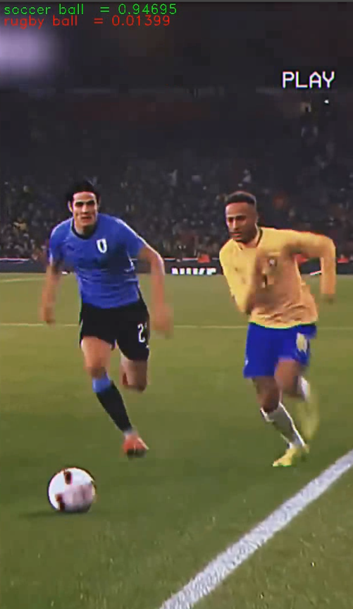

# VIDEO CLASSIFICATION

This is a repo that contains a peace of code modified in purpose to do video classification using the previous
image classifaction code contained in TensorFlow examples.

the files that it contains are :
- label_image.py (modified from the original) see original [here](https://github.com/tensorflow/tensorflow/blob/master/tensorflow/examples/label_image/label_image.py)
- in order to simulated we created a new folder called **'screens'** folder that store frames  inside of [data folder] (https://github.com/tensorflow/tensorflow/tree/master/tensorflow/examples/label_image/data)
- video sample: this should be in the data folder , so the
    - **video_path** and **screens_folder_path** should be changed to your loca system dir path
    - additionaly the video screens are recorded (recognized.avi) to visualize the test.

## if you want to see experiments view you can access the youtube demo

[demo](https://www.youtube.com/watch?v=mZdsx-WhCwo&ab_channel=ErrolWilderdMamaniCondori)

## instalation dependencies
* tensorflow clone [this] (https://github.com/tensorflow/tensorflow)
* and mainly python 3.7
* virtual env with anaconda
* bazel 5.3.0 to install full tensorflow examples

```
numpy 1.21.6
opencv2 4.2.0
tensorflow 1.2.3

```
## run
* train (in your virtual env or setting site)

```
python label_image.py
```

* results


